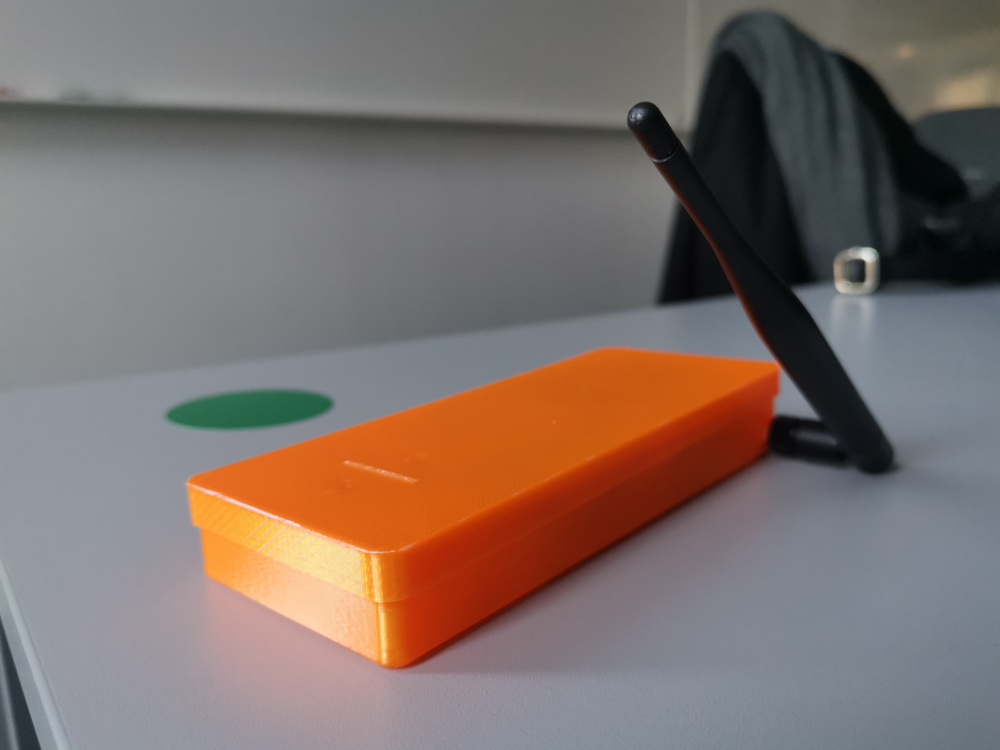
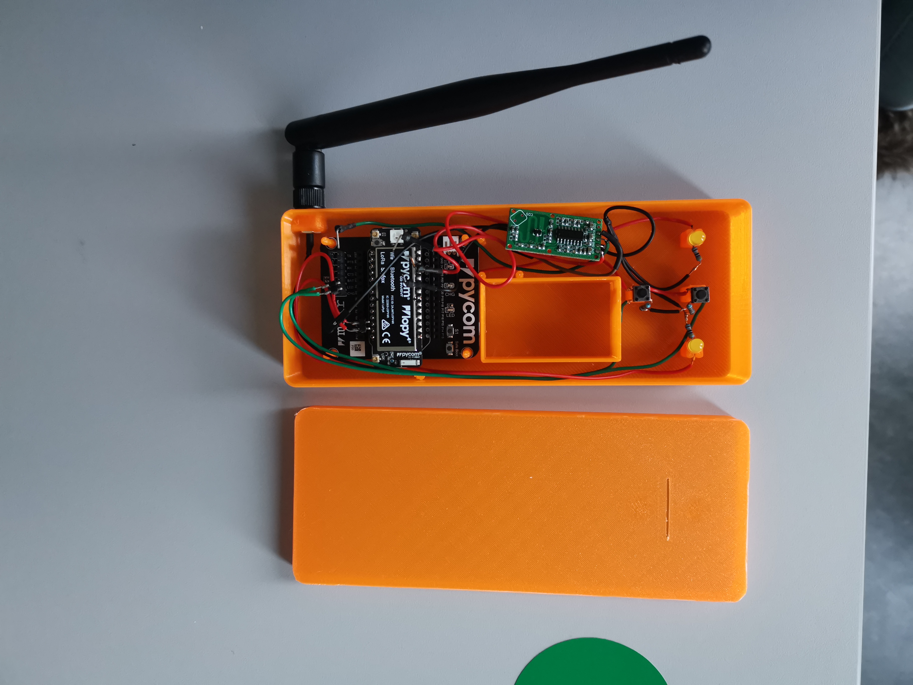

# team-18

# Smart car counter

## Abstract

Cant see embedded video? Here is the link!
https://youtu.be/MCtellI5bu4

This project aims to provide an better alternate method of keeping track of parking spaces in a parking lot. The current setup is stationary and prone to faults, thus the soulution should be a reliable and portable one. 

A portable device to be placed on each driving lane was developed, making use of a motion detector sensor. The sensor is triggered when a car passes over it and data is sent to an app that presents the live number of available parking spaces. 

## Background and idea
Kalmar kommun asked students at Linneaus university to: Parkeringsplats, fullt eller inte fullt, antal lediga platser. There is a solution right now doing this at many parkingspaces around the city, however there are problems with the current solution. It often show the wrong number of available spaces, and after talking to the contact person at Kalmar kommun, we understand that it requires a subscription or sorts.

Our first idea was to make a stationary solution, but after talkking to the contact at Kalmar kommun, and to our teacher it became clear that a portable sulotion would be more in line with what Kalmar kommun had in mind, and more in scope with the assignment. 

The initial idea was to have two sensors at a distance from eachother, and assume that the one that the car passes first would trigger first. This assumption would then be used to determine the direction of the car. The sensor that was chosen turned out to detect movement in all directions, making it very likely to detect things that are not cars. Taking this in to consideration it was decided that we would instead make a device that is to be placed on the drivinglane so that the cars drive over it. The fact that it now is blocked from below, and is furher from where people are likely to walk will hopefully help with only detecting cars. 

To further help with this the sensor could be shielded on the sides, a resistor can also be added that shortens the sensors range and thus reduce the likelihood of detecting people, birds ect.

Whith the cars driving over the detector, a lazer distance sensor cound probably be used, we didn't consider them with our other ideas because of their typically short range. On the other hand, utilising such a sensor, you could probably be very sure that it only triggers when a car drives over it.

We tried to power it with a 9V battery conected to the sensor, and then power the lopy4 via the sensors 3V3.

To determine the direction of the cars one device is placed on each driving-lane. There is a button on the device that lets you switch between the device laying on a lane where cars drive in to, or out of the parkinglot. Data is then, when the sensor is triggerd, sent to a calculator and middlehand to determine the number of available parking spaces. 

## Method

[Timelog](doc/timelog.md)

[Requirements](doc/requirements.md)

[Hardware](doc/hardware.md)

[Setup](doc/setup.md)

[Test](doc/test.md)

## Results

We succeded with making a program that works as intended with the buttons and the LEDs and the sensor. There is also a 3D printed case for everything and there was an atempt to solder everything together and have it work as a portable unit. we got it to work a few times u it did not work well and was super flimsy. The explanation was probably that we did not have a good solution for powering the device. The lopy4 turned out to need 3.5-5 V in and thus the 3v3 output was to weak. When trying to fix this useing a voltage regulator something went wrong and the lopy4 burned out (sorry) So now our only currently working option is to use a powerbank with USB.

We have a working app that that can display the data, it is also possible to change a few settings such as location as well as reading a little about the product and the members of the team.

Sending and reciving data via LORA and MQTT is still not working as well as we would want and this causes the data in the app and the data sent by the sensor to not agree 100 %.

## Reflections

### Emelie

Min uppgift var att ta hand om uppkopplingen. Det började med en tanke om att använda TTN för att sedan skicka vidare datan till en MQTT server genom en IFTTT applet. Detta skrotades till sist och ersattes av LoPy to LoPy kommunikation och direkt kommunikation till MQTT-servern via wifi.

Det svåraste med projektet var att komma igång. Vi hängde upp oss på sensorn mer än vi skulle gjort vilket satte stopp för resten av arbetet. Att man är ovan vid grupparbete på distans gjorde inte saken bättre.

Det roligaste var att få hålla på och koppla och testa sig fram för att få sensorn funka (så gott den kunde).

### Saleh

Detta var första gången för mig att programera en app. Det var väldigt utmanande att kunna presentera datan på ett snyggt sätt som det jag kom fram till med i appen, tycker jag åtminstone. Väldigt kul och lärorikt upplevelse.  Eftersom appen behöver få in datan var det lämpligast att programera huvudenheten samtidigt. 

Svårast var det att kunna lära sig flera olika bibliotek på så kort tid. Vissa gånger ville scripten bara inte fungera trötts att det inte fanns något fel i det. Väldigt utmanande att hitta på flera olika sätt att kunna lösa en och samma sak, bara för att ibland ville det inte fungera som man ville.

Jag är väldigt nöjd över det jag fick lära mig under detta projekt, att man fick välja precis det man ville göra var nog det bästa med det då det är mest lärande att man gör något man tycker om! :)

### Elin

Jag var mest ansvarig för vilken logik som skulle användas när sensorn detekterade någonting, att koppla ihop och programmera hårdvaran och att designa ett case till alla delar.

Det svåraste var att släppa att sensorn inte var optimal för ändamålet och den lösning vi hade tänkt först, tillslut blev det någon sorts kompromiss där vi körde på den befintliga sensorn, men försökte anpassa lösningen till hur den funkar.

Det roligaste var att koppla ihop allting och se hur det fungerade tillsammans. Det var kul att lära sig mer om att arbeta i 3D, och det var kul att löda ihop allting, även om något gick fel så att det inte funkade på slutet.

